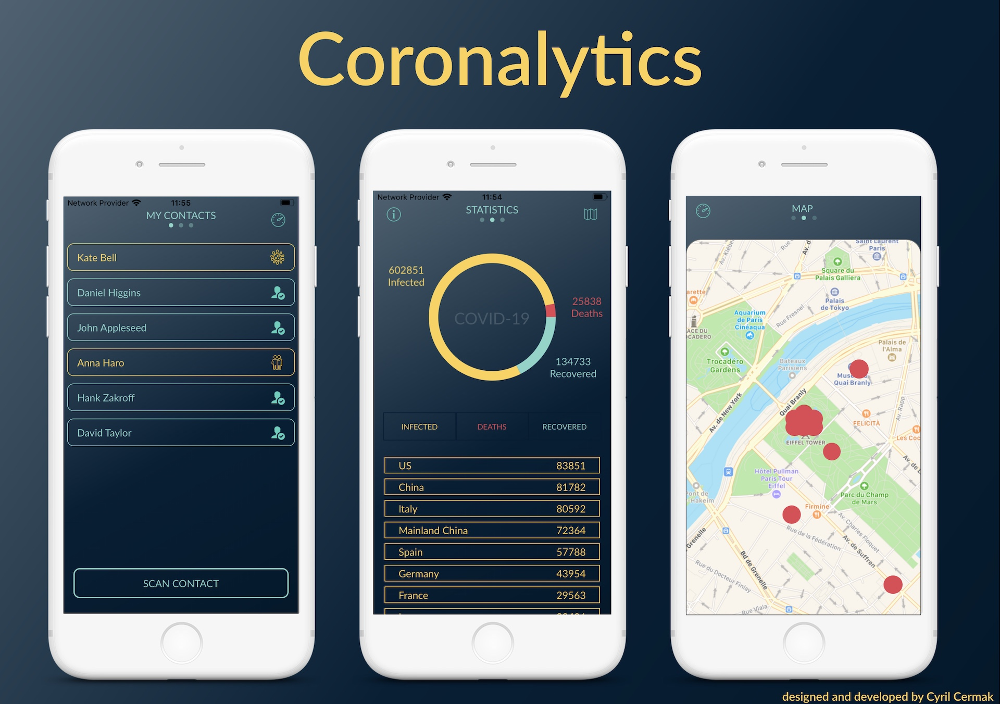

# Coronalytics iOS app

## Inspiration
Working freelancers, people that have to go out and meet other people, can check upfront based on a phone number whether the person who they are going to meet can be infected or whether the person knows someone infected. The current design of the app goes one level in depth in the contact list.

This solution would enable `smart quarantine` for countries. However, exposes users private data (phone contacts) to the system.

App also provides general statistics about Coronavirus spread. Due to lack of time, map visualisation has not been finished yet.

## What it does
The app checks contacts of a contact into the level 1 depth so far.
Based on that three states are determined:
 - clear, a person who does not have any touch with infected people based on his phone book
 - friendsInfected, a person who has in his list somebody positive, therefore there is a risk that this person might also get infected
 - infected, a person who was tested positive for COVID-19

## How it works
//TODO: add repo here
Coronalytics app consumes CoronalyticsAPI (more in the repo of the API).
API provides:
  - the daily virus spread data
  - phone number check
  - update of infected number with its contact list (available for the COVID19 test centres)

The API was built with Vapor3 ❤️.  
